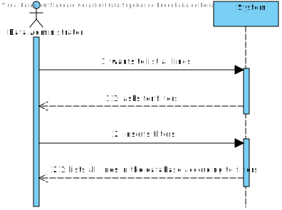
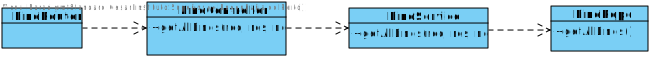

 UC08
=======================================

# 1. Requirements

**1** As a data administrator, I want to list all lines.

This requirement should allow the data administrator to list lines according to filters inserted(by name or code).

# 2. Analyze

## Brief format

The data administrator wants to list all lines. The system asks for filters. The data administrator inserts the filters. The system lists all filtered lines.

## SSD

## Full Format

### Main Actor

Data Administrator

## Stakeholders and their interests

* **Data Administrator:** wants to check lines according to filters.

## Pre Conditions

-

## After Conditions 

-

## Main success scenario (or basic flow)

1.The data administrator wants to list all lines.
2.The system asks for filters.
3.The data administrator inserts the filters.
4.The system lists all filtered lines.

## Extensions (or alternative flow)

*a. The data administrator requests to cancel while system is listing.

> The use case ends.

## Occurrence frequency
-

## Open questions
-

# 3. Design

## 3.1. Sequence Diagram

## 3.2. Class Diagram

## 3.3. Tests
Postman test: ListAllLinesTest.

# 4. Comments

-