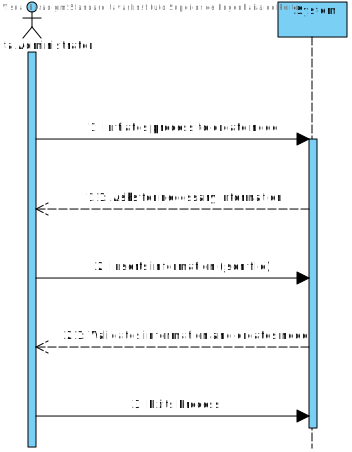
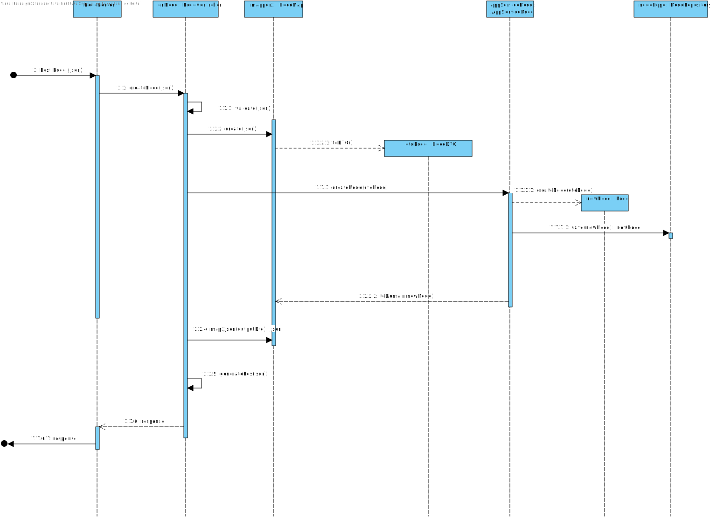

# UC02
=======================================

# 1. Requirements

**02** As Data Administrator, I want to create nodes indicating their names, if they are or a not pick up point or a closure point and the coordinates.

- 02. Create Node Class.

This requirement should allow the data administrator to create a node knowing:
name,if they are or a not pick up point or a closure point and the coordinates.

# 2. Analysis

## Brief Format

The Data Administrator initiates process to create node. The system asks for necessary information. The Data Administrator inserts information (json file). The system validates information and creates node. The data administrator exits process.

## SSD

## Complete Format

### Main Actor

Data Administrator

## Interested Parts and their interest

* **Data Administrator:** wants to create a node and store it in the repository.

## Pre-conditions
n/a

## Post-conditions

The Node is stored in the system.

## Main Sucess scenery (or basic flux/flow)

1.The Data Administrator initiates process to create node.
2.The system asks for necessary information.
3.The Data Administrator inserts information (json file).
4.The system validates information and creates node.
5.The data administrator exits process.

## Extentions(or alternative flux/flow)

*a. The data administrator cancels the creation of a new node

> The use case ends.

4a. Missing information on the json file.

>	1. The systems informs the user of the missing fields.
>	2. The system allows for the introduction of a new file.
>
	> 2a.The data administrator doesn't introduce a new file. The use case ends.

## Occurance frequency

Whenever it's necessary.

## Open Questions
-

# 3. Design

## 3.1. Execution of the Functionality

## 3.2. Class Diagram

## 3.3. Applied Schemas

*Nesta secção deve apresentar e explicar quais e como foram os padrões de design aplicados e as melhores práticas*

## 3.4. Testes 
*Nesta secção deve sistematizar como os testes foram concebidos para permitir uma correta aferição da satisfação dos requisitos.*

**Teste 1:** Verificar que é possível adicionar uma Categoria a uma matéria prima

	@Test
    public void testAdicionarCategoria() {
        System.out.println("adicionarCategoria");
        eapli.base.domain.Categoria categoria = new Categoria("codigo","descricao");
        MateriaPrima instance = new MateriaPrima();
        instance.adicionarCategoria(categoria);
    }

# 4. Implementação

*Nesta secção a equipa deve providenciar, se necessário, algumas evidências de que a implementação está em conformidade com o design efetuado. Para além disso, deve mencionar/descrever a existência de outros ficheiros (e.g. de configuração) relevantes e destacar commits relevantes;*

*Recomenda-se que organize este conteúdo por subsecções.*

# 5. Integração/Demonstração

*Nesta secção a equipa deve descrever os esforços realizados no sentido de integrar a funcionalidade desenvolvida com as restantes funcionalidades do sistema.*

# 6. Observações

*Nesta secção sugere-se que a equipa apresente uma perspetiva critica sobre o trabalho desenvolvido aponta