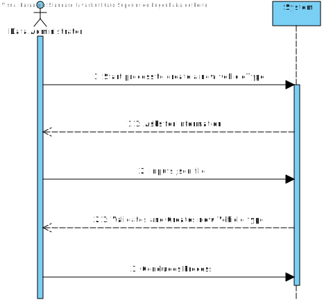
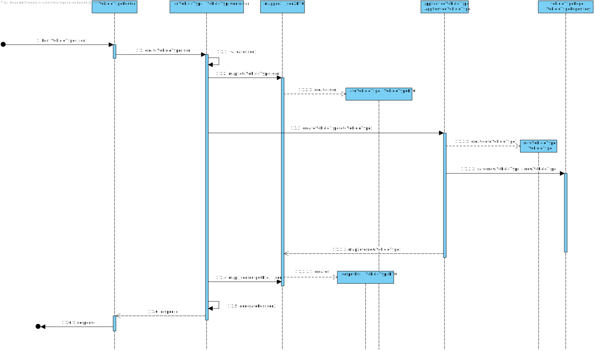
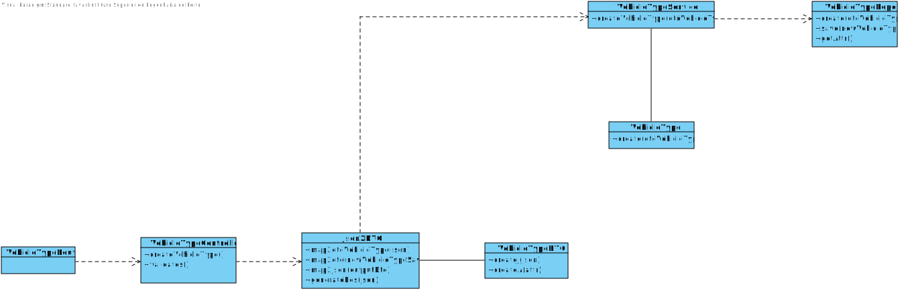

# UC_06
=======================================

# 1. Requirements

**06** 2. 6.Has data administrator, I want to create Vehicle Types (ex., “gas fueled minibus”), indicating it's fuel type (i.e., Diesel, Petrol, Eletric, GPL, Gas), range, cost per kilometer, average consumption e average speed.

- 2001.1. Create Vehicle Type Classe.

This use case should allow the data administrator to create a new vehicle type indicating:
name, fuel type, range, cost per kilometer, average consumption, average speed.

# 2. Analysis

## Brief format

The data administrator starts process to create a new Vehicle Type. The system asks for information. The data administrator Inputs json file. The system validates and creates new vehicle type. The data administrator concludes process.
## SSD

## Complete Format

### Ator Principal

Data Administrator

## Interested Parties and their interests

* **Data Administrator:** wants to create a new vehicle type.
## Pre-conditions
n/a

## Post-conditions

The new vehicle type is stored on the repository

## Principal Sucess Scenary (or basic flux/flow)

1.The data administrator starts process to create a new Vehicle Type.
2.The system asks for information.
3.The data administrator Inputs json file.
4.The system validates and creates new vehicle type.
5.The data administrator concludes process.

## Extentions (or alternative flux/flow)

*a. The data administrator cancels the creations of a new vehicle type

> The use case finishes

4a. The json file does not have all the required information.

>	1. The system fails to create a new vehicle type and provides an error notification allowing the user to try again
>
	> 2a. The data administrator doesn't try again. The use case ends.

5a. The system detects repeated information on the repository and askes the user if it is intended.
>	1. If it is intended the system creates another instance.
>	2. If not, the system aborts the creation of a new instance.
>

## Frequency of execution

>As many as necessary

## Open Questions
-

# 3. Design

## 3.1. Realization of the UC

## 3.2. Class Diagram

## 3.3. Applied Practices

*Nesta secção deve apresentar e explicar quais e como foram os padrões de design aplicados e as melhores práticas*

## 3.4. Testes 
*Nesta secção deve sistematizar como os testes foram concebidos para permitir uma correta aferição da satisfação dos requisitos.*

**Teste 1:** Verificar que é possível adicionar uma Categoria a uma matéria prima

	@Test
    public void testAdicionarCategoria() {
        System.out.println("adicionarCategoria");
        eapli.base.domain.Categoria categoria = new Categoria("codigo","descricao");
        MateriaPrima instance = new MateriaPrima();
        instance.adicionarCategoria(categoria);
    }

# 4. Implementação

*Nesta secção a equipa deve providenciar, se necessário, algumas evidências de que a implementação está em conformidade com o design efetuado. Para além disso, deve mencionar/descrever a existência de outros ficheiros (e.g. de configuração) relevantes e destacar commits relevantes;*

*Recomenda-se que organize este conteúdo por subsecções.*

# 5. Integração/Demonstração

*Nesta secção a equipa deve descrever os esforços realizados no sentido de integrar a funcionalidade desenvolvida com as restantes funcionalidades do sistema.*

# 6. Observações

*Nesta secção sugere-se que a equipa apresente uma perspetiva critica sobre o trabalho desenvolvido apontando, por exemplo, outras alternativas e ou trabalhos futuros relacionados.*