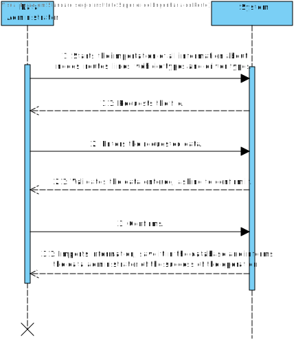

 US01
=======================================

# 1. Requirements

**1** As a data administrator, I want to import nodes, routes, lines, vehicle types and driver types.

This requirement should allow the data administrator to import a file that contains the following information: nodes,routes,lines,vehicle types and driver types.

# 2. Analyze

## Brief format

The data administrator starts the importation of all information about nodes, routes, lines, vehicle types and driver types. The system requests the file. The data administrator enters the requested data. The system validates the data entered, asking to confirm it. The data administrator confirms. The system imports information, save it in the database and informs the data administrator of the success of the operation.

## SSD

## Full Format

### Main Actor

Data Administrator

## Stakeholders and their interests

* **Data Administrator:** wants to import nodes, routes, lines, vehicle types and driver type so that can be used later.

## Pre Conditions

A file with all the information to import.

## After Conditions 

Nodes, routes, lines, vehicle types and driver type are saved in the system.

## Main success scenario (or basic flow)

1.The data administrator starts the importation of all information about nodes, routes, lines, vehicle types and driver types.
2.The system requests the file.
3.The data administrator enters the requested data.
4.The system validates the data entered, asking to confirm it.
5.The data administrator confirms.
6.The system imports information, save it in the database and informs the data administrator of the success of the operation.

## Extensions (or alternative flow)

*a. The data administrator requests to cancel the import of the information.

> The use case ends.

4a. Missing minimum required data.

>	1. The system informs the missing data.
>	2. The system allows the entry of missing data (step 3).
>
	> 2a. The data administrator don't change the data. The use case ends.

5a. The system detects that de entered file isn't valid.

>	1. The system informs the missing data.
>	2. The system allows the entry of missing data (step 3).
>
	> 2a. The data administrator don't change the data. The use case ends.

## Occurrence frequency
-

## Open questions
-

# 3. Design

## 3.1. Sequence Diagram

## 3.2. Class Diagram

# 6. Comments

In the SD and CD, only VehicleType was used as the import object, because if we had to place all the objects to import, the SD and CD would be long and confusing.
