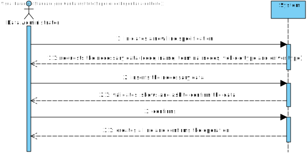
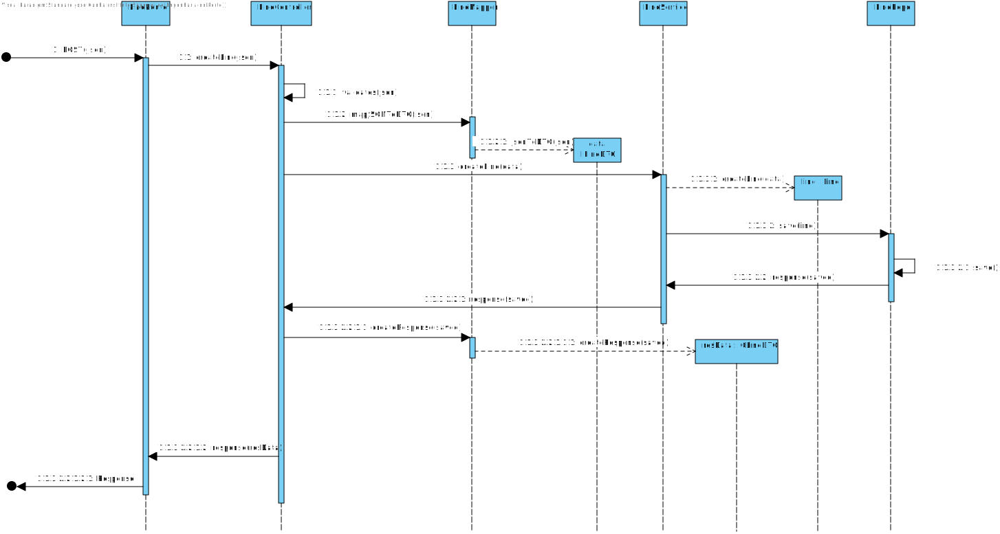
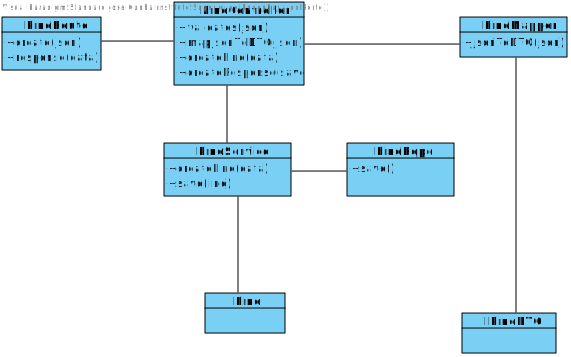

# UC03
=======================================

# 1. Requirements

**03** As Data Administrator, I want to create lines.

- 03. Create Line Class.

This requirement should allow the data administrator to create a line knowing:
key, name, linePath, .

# 2. Analysis

## Brief Format

The Data Administrator initiates process to create Line. The system asks for necessary information. The Data Administrator inserts information (json file). The system validates information and creates line. The data administrator exits process.

## SSD

## Complete Format

### Main Actor

Data Administrator

## Interested Parts and their interest

* **Data Administrator:** wants to create a line and store it in the repository.

## Pre-conditions
n/a

## Post-conditions

The Line is stored in the system.

## Main Sucess scenery (or basic flux/flow)

1.The Data Administrator initiates process to create line.
2.The system asks for necessary information.
3.The Data Administrator inserts information (json file).
4.The system validates information and creates line.
5.The data administrator exits process.

## Extentions(or alternative flux/flow)

*a. The data administrator cancels the creation of a new line

> The use case ends.

4a. Missing information on the json file.

>	1. The systems informs the user of the missing fields.
>	2. The system allows for the introduction of a new line.
>
	> 2a.The data administrator doesn't introduce a new line. The use case ends.

## Occurance frequency

Whenever it's necessary.

## Open Questions
-

# 3. Design

## 3.1. Execution of the Functionality

## 3.2. Class Diagram

## 3.3. Applied Schemas

	import { ILinePersistence } from '../persistence/interface/ILinePersistence';
	import * as mongoose from 'mongoose';
	import { DriverType } from '../domain/models/DriverType';
	import { VehicleType } from '../domain/models/VehicleType';
	import { LinePath } from '../domain/models/LinePath';
	const LineSchema = new mongoose.Schema(
	  {
	    domainId: {
	        type: String,
	        unique: true
	    },
	    key: {
	        type: String
	    },
	    name: { 
	        type: String, 
	        unique: true,
	    },
	    color: {
	        type: String
	    },
	    linePaths: {
	        type: Array<LinePath>()
	    },
	    allowedVehicles: {
	        type: Array<VehicleType>()
	    },
	    allowedDrivers: {
	        type: Array<DriverType>()
	    }
	  }
	);
	export default mongoose.model<ILinePersistence & mongoose.Document>('Line', LineSchema);

## 3.4. Testing 

**Teste 1:** Check creation of a new Line

    describe('Create a valid Line', () => {
    	let line = Line.create({key: "teste", name: "teste", color: "RGB(0,0,0)", linePaths: null, allowedVehicles: null, allowedDrivers: null} as ILineDTO);
	    it("Key", () => {
	        expect(line.getValue().props.key).to.equal("teste");
	    });
	    it("Name", () => {
	        expect(line.getValue().props.name).to.equal("teste");
	    });
	    it("Color", () => {
	        expect(line.getValue().props.color).to.equal("RGB(0,0,0)");
	    });
	    it("Line Path", () => {
	        expect(line.getValue().props.linePaths).to.equal(null);
	    });
	    it("Allowed Drivers", () => {
	        expect(line.getValue().props.allowedDrivers).to.equal(null);
	    });
	    it("Allowed Vehicles", () => {
	        expect(line.getValue().props.allowedVehicles).to.equal(null);
	    });
	});

# 4. Implementação

*Nesta secção a equipa deve providenciar, se necessário, algumas evidências de que a implementação está em conformidade com o design efetuado. Para além disso, deve mencionar/descrever a existência de outros ficheiros (e.g. de configuração) relevantes e destacar commits relevantes;*

*Recomenda-se que organize este conteúdo por subsecções.*

# 5. Integração/Demonstração

*Nesta secção a equipa deve descrever os esforços realizados no sentido de integrar a funcionalidade desenvolvida com as restantes funcionalidades do sistema.*

# 6. Observações

*Nesta secção sugere-se que a equipa apresente uma perspetiva critica sobre o trabalho desenvolvido aponta