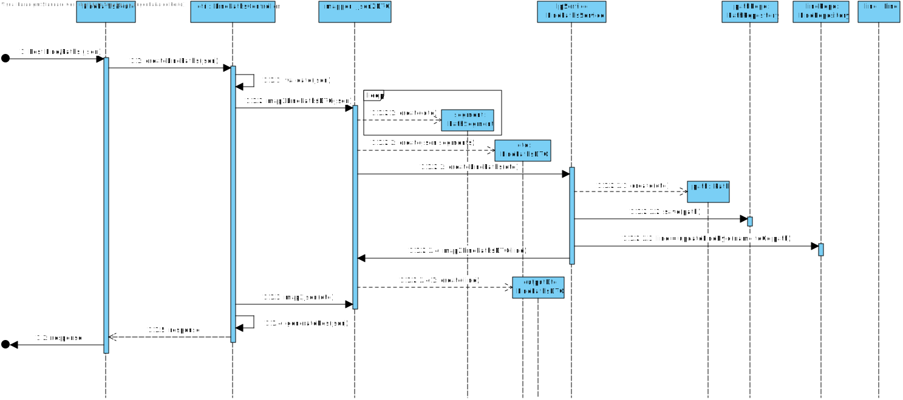

 UC04
=======================================

# 1. Requirements

**1** As a data administrator, I want to define a line go path/return path.

This requirement should allow the data administrator to insert a go path/return path with its nodes.

# 2. Analyze

## Brief format

The data administrator wants to add a path to a line. The system asks what line. The data administrator inserts a line. The system asks for a path.The data administrator inserts a path. The system validates and shows a successfull message.

## SSD

## Full Format

### Main Actor

Data Administrator

## Stakeholders and their interests

* **Data Administrator:** wants to add a path to a line.

## Pre Conditions

-

## After Conditions 

-

## Main success scenario (or basic flow)

1.The data administrator wants to add a path to a line.
2.The system asks what line. 
3.The data administrator inserts a line.
4.The system asks for a path.
5.The data administrator inserts a path.
6.The system validates and shows a successfull message.

## Extensions (or alternative flow)

*a. The data administrator requests to cancel while system is listing.

> The use case ends.

4a. Inserted line not found.

>	1. The system informs that the line doesn't exist.
>	2. The system allows the entry of another line (step 3).
>
	> 2a. The data administrator don't change the line. The use case ends.

## Occurrence frequency
-

## Open questions
-

# 3. Design

## 3.1. Sequence Diagram

## 3.2. Class Diagram

## 3.3. Tests

**Test 1:** Check creation of a new Path(valid)

describe('Create a valid Path', () => {

	(...)	

    it("ensure all Parameters are well formed", () => {
        expect(path.getValue().props.key).to.equal("teste");
        expect(path.getValue().props.isEmpty).to.equal(false);
        expect(path.getValue().props.pathNodes[0]).to.equal(seg1);
        expect(path.getValue().props.pathNodes[1]).to.equal(seg2);
        expect(path.getValue().props.pathNodes[2]).to.equal(seg3);
        expect(path.getValue().props.totalDur).to.equal(10);
        expect(path.getValue().props.totalDist).to.equal(10);
    });
});

**Test 2:** Check creation of a new Path(invalid)

describe('Cant create an invalid Path with empty key', () => {

	(...)

    it("ensure it fails with an invalid path", () => {
        expect(path.error).to.equal("Must provide a path key");
    });
});

**Test 3:** Check creation of a new Path(invalid)

describe('Cant create an invalid Path with null key', () => {

	(...)

    it("ensure it fails with an invalid path", () => {
        expect(path.error).to.equal("Must provide a path key");
    });
});

# 4. Comments

-