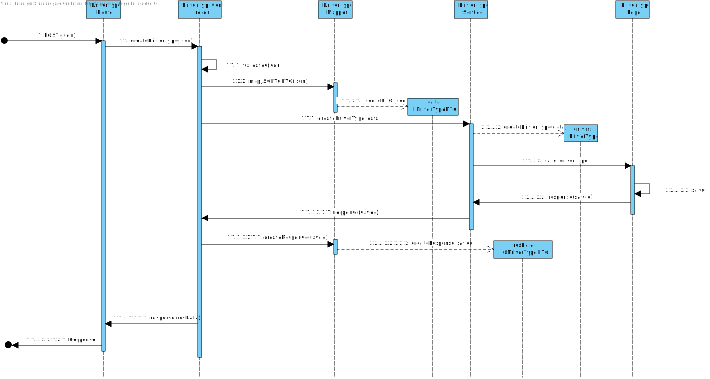

# UC05
=======================================

# 1. Requirements

**5** As Data Administrator, I want to create driverTypes.

- 05. Create Driver Type Class.

This requirement should allow the data administrator to create driverTypes.

# 2. Analysis

## Brief Format

The Data Administrator initiates process to create Driver Type. The system asks for necessary information. The Data Administrator inserts information (json file). The system validates information and creates Driver type. The data administrator exits process.

## SSD

## Complete Format

### Main Actor

Data Administrator

## Interested Parts and their interest

* **Data Administrator:** wants to create a driver type and store it in the repository.

## Pre-conditions
n/a

## Post-conditions

The Driver Type is stored in the system.

## Main Sucess scenery (or basic flux/flow)

1.The Data Administrator initiates process to create driver type.
2.The system asks for necessary information.
3.The Data Administrator inserts information (json file).
4.The system validates information and creates driver type.
5.The data administrator exits process.

## Extentions(or alternative flux/flow)

*a. The data administrator cancels the creation of a new driver type

> The use case ends.

4a. Missing information on the json file.

>	1. The systems informs the user of the missing fields.
>	2. The system allows for the introduction of a new driver type.
>
	> 2a.The data administrator doesn't introduce a new driver type. The use case ends.

## Occurance frequency

Whenever it's necessary.

## Open Questions
-

# 3. Design

## 3.1. Execution of the Functionality

## 3.2. Class Diagram

## 3.3. Applied Schemas

*Nesta secção deve apresentar e explicar quais e como foram os padrões de design aplicados e as melhores práticas*

	import { IDriverTypePersistence } from '../persistence/interface/IDriverTypePersistence';
	import * as mongoose from 'mongoose';
	const DriverTypeSchema = new mongoose.Schema(
	  {
	    domainId: {type: String, unique: true},
	    description: { type: String, unique: true}
	  }
	);
	export default mongoose.model<IDriverTypePersistence & mongoose.Document>('DriverType', DriverTypeSchema);

## 3.4. Testes 
*Nesta secção deve sistematizar como os testes foram concebidos para permitir uma correta aferição da satisfação dos requisitos.*

**Teste 1:** Verificar que é possivel criar Driver Type.

	@Test
    describe('Create a valid Driver Type', () => {
	    let driver = DriverType.create({description: "Teste"} as IDriverTypeDTO);
	    it("ensure all Parameters are well formed", () => {
	        expect(driver.getValue().props.description).to.equal("Teste");
	    });
    });

**Teste 2:** Verificar que não é possivel criar Driver Type.

    @Test
	describe('Create a invalid Driver Type', () => {
	    let driver = DriverType.create({description: ""} as IDriverTypeDTO);
	    it("ensure all Parameters are well formed", () => {
	        expect(driver.error).to.equal("Must provide a description");
	    });
	});

# 4. Implementação

*Nesta secção a equipa deve providenciar, se necessário, algumas evidências de que a implementação está em conformidade com o design efetuado. Para além disso, deve mencionar/descrever a existência de outros ficheiros (e.g. de configuração) relevantes e destacar commits relevantes;*

*Recomenda-se que organize este conteúdo por subsecções.*

# 5. Integração/Demonstração

*Nesta secção a equipa deve descrever os esforços realizados no sentido de integrar a funcionalidade desenvolvida com as restantes funcionalidades do sistema.*

# 6. Observações

*Nesta secção sugere-se que a equipa apresente uma perspetiva critica sobre o trabalho desenvolvido aponta