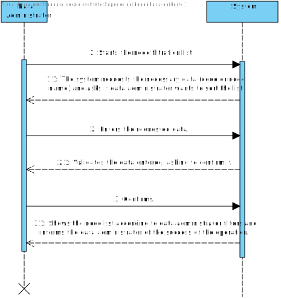
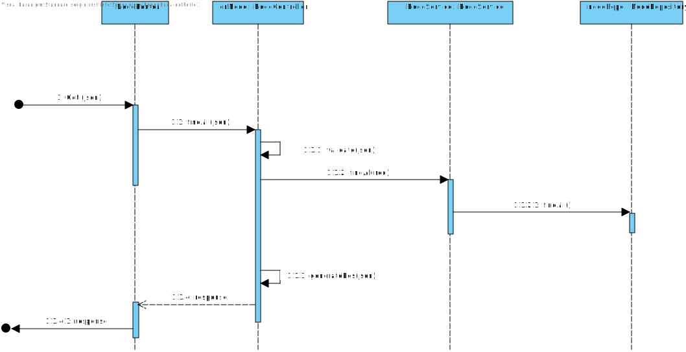
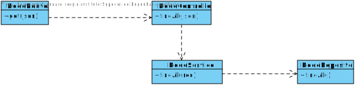

US07
=======================================

# 1. Requirements

**7** As a data administrator, I want to list nodes.
- 7.1. The data administrator must be able to sort by code / name and filter the results by code / name (eg, all nodes whose name starts with “Par”).

This requirement should allow the data administrator to see the list of nodes according to his filtration

# 2. Analyze

## Brief format

The data administrator starts the node filtration list. The system requests the necessary data (code or node name) and asks if data administrator wants to sort the list. The data administrator enters the requested data. The system validates the data entered, asking to confirm it. The data administrator confirms. The system shows the node list according to data administrator filters and informs the data administrator of the success of the operation.

## SSD

## Full Format

### Main Actor

Data Administrator

## Stakeholders and their interests

* **Data Administrator:** wants to see the node list according to his filters.

## Pre Conditions

The existence of Nodes in the database.

## After Conditions 

n/a.

## Main success scenario (or basic flow)

1.The data administrator starts the node filtration list.
2.The system requests the necessary data (code or node name) and asks if data administrator wants to sort the list.
3.The data administrator enters the requested data.
4.The system validates the data entered, asking to confirm it.
5.The data administrator confirms.
6.The system shows the node list according to data administrator filters and informs the data administrator of the success of the operation.

## Extensions (or alternative flow)

*a. The data administrator requests to cancel the import of the information.

> The use case ends.

4a. Missing minimum required data.

>	1. The system informs the missing data.
>	2. The system allows the entry of missing data (step 3).
>
	> 2a. The data administrator don't change the data. The use case ends.

5a. The system detects that de entered code/node name isn't valid.

>	1. The system informs the missing data.
>	2. The system allows the entry of missing data (step 3).
>
	> 2a. The data administrator don't change the data. The use case ends.

## Occurrence frequency
-

## Open questions
-

# 3. Design

## 3.1. Sequence Diagram

## 3.2. Class Diagram

